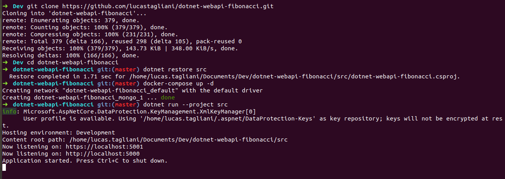

dotnet-webapi-fibonacci
===

Repo to play a little with dotnet core webapi in fibonacci algorithm in some different ways.

_Actually, this repo makes no real sense, but has TDD, CI and others good engineering pratices._  

_Oh, it runs on Windows and Linux at least, both visual studio and visual code._

## How to run it

In command line:

1. Clone the repository: 

    SSH: `git clone git@github.com:lucastagliani/dotnet-webapi-fibonacci.git`  
    or  
    HTTP: `git clone https://github.com/lucastagliani/dotnet-webapi-fibonacci.git`

2. Enter the repository folder: `cd dotnet-webapi-fibonacci`

3. Restore dependencies: `dotnet restore src`

4. Run API: `dotnet run --project src`

    _It will be running on http://localhost:5050_

    If you hit http://localhost:5050/api/fibonacci on your brower or API app like Postamn, you should get some data returned. 

## How to test it 

`dotnet test test`

## Documentation

_At this moment, this API has these options:_

`GET` http://localhost:5050/api/fibonacci/until  
`GET` http://localhost:5050/api/fibonacci/until/1000  
`GET` http://localhost:5050/api/fibonacci/length  
`GET` http://localhost:5050/api/fibonacci/length/1000  

