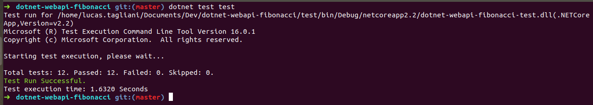

dotnet-webapi-fibonacci
===

Repo to play a little with dotnet core webapi in fibonacci algorithm in some different ways.

_Actually, this repo makes no real sense, but has TDD, CI and others good engineering pratices._  

_Oh, it runs on Windows and Linux at least, both visual studio and visual code._

## Before running it

1. You need to have .NET Core!

You can download it here: https://dotnet.microsoft.com/download

After install this, you can check if everything is OK by typing `dotnet --version` in your command line.

2. You also need* Docker Compose!

_* Unless you would like to use your own Mongo server locally._

You can download it here: https://docs.docker.com/compose/install/

After install this, you can check if everything is OK by typing `docker-compose --version` in your command line.

## How to run it

In command line:

1. Clone the repository: 

    SSH: `git clone git@github.com:lucastagliani/dotnet-webapi-fibonacci.git`  
    or  
    HTTP: `git clone https://github.com/lucastagliani/dotnet-webapi-fibonacci.git`

2. Enter the repository folder: `cd dotnet-webapi-fibonacci`

3. Restore dependencies: `dotnet restore src`

4. If you do not want to run Mongo locally, you will need to `docker-compose up -d`

5. Run API: `dotnet run --project src`

    _It will be running on http://localhost:5000_

    If you hit http://localhost:5000/api/fibonacci on your browser or API app (for example Postman), you should get some data returned. 

## How to test it 

`dotnet test test`

## Documentation

_At this moment, this API has these options:_

`GET` https://dotnet-webapi-fibonacci.herokuapp.com/api/fibonacci/until  
`GET` https://dotnet-webapi-fibonacci.herokuapp.com/api/fibonacci/until/100
`GET` https://dotnet-webapi-fibonacci.herokuapp.com/api/fibonacci/length  
`GET` https://dotnet-webapi-fibonacci.herokuapp.com/api/fibonacci/length/10  

